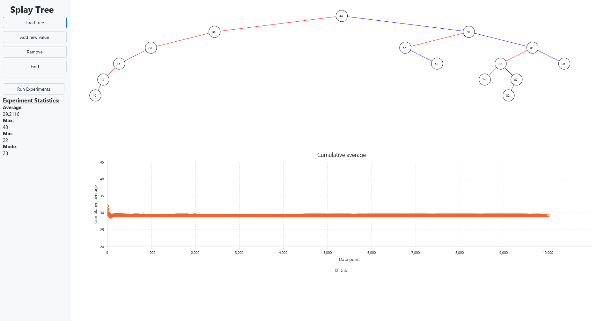

# Splay Tree

A JavaFX desktop application that visualizes a [splay tree](https://en.wikipedia.org/wiki/Splay_tree) — a
self-adjusting binary search tree that moves every accessed node to the root. Add, find and remove keys and
watch the tree restructure itself, or run a batch of experiments to chart how the tree height behaves.



## Features

- Interactive visualization of the tree after every insert, find and remove
- Load a sample data set from `data/products.txt`
- Random key generator for quickly filling the tree
- Experiment runner: builds 10 000 trees of 1 023 random keys each and reports average, min, max and modal
  height, plus a cumulative-average chart. Each run is written to `./experiments/`

## Requirements

- **JDK 25** — any distribution

## Installation

### 1. Build

```bash
./gradlew build
```

```powershell
# Windows
.\gradlew.bat build
```

### 2. Run

```bash
./gradlew run
```

Run the application from the project root — the "Load tree" action reads `./data/products.txt` and the
experiment runner writes to `./experiments/`, both resolved relative to the working directory.

## Testing

```bash
./gradlew test
```

The test suite covers the `SplayTree` implementation (insert, lookup, removal, size and height).

## Tech stack

| Component            | Version |
|----------------------|---------|
| Java                 | 25      |
| Gradle               | 9.7     |
| JavaFX               | 26.0.2  |
| AtlantaFX            | 2.1.0   |
| Apache Commons Lang3 | 3.20.0  |
| JUnit                | 6.1.2   |
